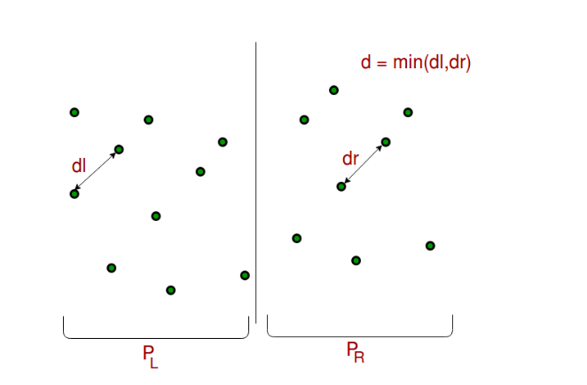

# Closest Pair of Points

## Introduction
given an array of n points in the plane, and the problem is to find out the closest pair of points in the array.
## Description
Closest Pair of Points problem revolves around identifying the pair of points with the smallest Euclidean distance among a given set of points in a two-dimensional plane. We are provided with a set of n points, denoted as ｛p1,p2,...,pn｝where each point pi is defined by its(x,y) coordinates.
The task is to find the pair of points (p i,p j) within this set, minimizing their Euclidean distance ||pi-pj||.



## Gold
Identify the pair of points with the smallest Euclidean distance within a given set, facilitating efficient spatial analysis and computational geometry applications.

## Soultion

### Brute Force

#### Algorithmic principle
Solve the problem by exhaustively listing all possible solutions, and then find the optimal solution that meets the conditions. Explore every possible combination of points and select the pair with the smallest distance, ensuring a thorough search for the closest pair within the dataset.

#### Pseudocode

```
ClosestPairBruteForce(P)
    minDistance = ∞
    closestPair = None
    
    for each point p1 in P:
        for each point p2 in P:
            if p1 ≠ p2:
                distance = EuclideanDistance(p1, p2)
                if distance < minDistance:
                    minDistance = distance
                    closestPair = (p1, p2)
    
    return closestPair

```
#### Operate
- The algorithm systematically examines all possible pairs of points within the given set.
- For each pair of points, it calculates the Euclidean distance between them.
- It keeps track of the pair with the smallest distance encountered so far.
- After comparing distances between all pairs, it selects the pair with the minimum distance as the optimal solution.

  
#### Algorithm Implement

```
// Function to calculate the Euclidean distance between two points
double distance(const Point& p1, const Point& p2) {
    return sqrt(pow(p1.x - p2.x, 2) + pow(p1.y - p2.y, 2));
}

// Brute Force method to find the closest pair of points
pair<Point, Point> closestPairBruteForce(const vector<Point>& points) {
    double minDistance = numeric_limits<double>::max();
    pair<Point, Point> closestPair;

    for (size_t i = 0; i < points.size(); ++i) {
        for (size_t j = i + 1; j < points.size(); ++j) {
            double dist = distance(points[i], points[j]);
            if (dist < minDistance) {
                minDistance = dist;
                closestPair = make_pair(points[i], points[j]);
            }
        }
    }

    return closestPair;
}

```

#### Time complexity

In the Brute Force method, we need to compare n given points pairwise to calculate the distance between them. Therefore, the total time complexity is O (n<sup>2</sup>), where n is the number of points.

### 1-D version

#### Algorithmic principle
Exploit the sorted nature of the points along the one-dimensional space. By sorting the points initially, the algorithm ensures that the closest pair of points will be adjacent to each other in the sorted list, thereby simplifying the process of finding the closest pair. 

#### Pseudocode

```
ClosestPair1D(P)
    Sort points in array P
    minDistance = +∞
    closestPair = None
    for i = 1 to n-1 do
        distance = P[i+1] - P[i]
        if distance < minDistance then
            minDistance = distance
            closestPair = (P[i], P[i+1])
    return closestPair
```
#### Operate
- Sort the given points according to their coordinates in one-dimensional space.
- Initialize the minimum distance to positive infinity.
- Initialize variables to store the closest pair of points.
- Traverse the sorted point set.
     - Calculate the distance between adjacent points.
     - If the distance is less than the minimum distance, update the minimum distance and the closest point pair.
- Return the closest point pair.

  
#### Algorithm Implement

```
// Function to calculate the distance between two points
double distance(const Point& p1, const Point& p2) {
    return abs(p1.x - p2.x);
}

// Function to find the closest pair of points in 1D space
pair<Point, Point> closestPair1D(vector<Point>& points) {
    // Sort points based on their coordinates
    sort(points.begin(), points.end(), [](const Point& p1, const Point& p2) {
        return p1.x < p2.x;
    });

    // Initialize minimum distance to positive infinity
    double minDistance = numeric_limits<double>::infinity();
    pair<Point, Point> closestPair;

    // Iterate through sorted points and find closest pair
    for (size_t i = 0; i < points.size() - 1; ++i) {
        double dist = distance(points[i], points[i + 1]);
        if (dist < minDistance) {
            minDistance = dist;
            closestPair = make_pair(points[i], points[i + 1]);
        }
    }

    return closestPair;
}

```

#### Time complexity

The time complexity of the 1-D version of the Closed Pair of Points algorithm is O (n log n), where n is the number of points.

### Divide and Conquer

#### Algorithmic principle
By dividing the problem into smaller sub problems, recursively solving these sub problems, and merging their solutions to solve the original problem. 

#### Pseudocode

```
Closest-Pair(p1, ..., pn) {
    Compute separation line L such that half the points
    are on one side and half on the other side.
    
    δ1 = Closest-Pair(left half)
    δ2 = Closest-Pair(right half)
    δ = min(δ1, δ2)
    
    Delete all points further than δ from separation line L
    Sort remaining points by y-coordinate.
    
    Scan points in y-order and compare distance between
    each point and next 11 neighbors. If any of these
    distances is less than δ, update δ.
    
    return δ.
}

```
#### Operate
- Firstly, a segmentation line L is determined by some method, so that the given set of points is divided into two halves, with half of the points located on one side of the segmentation line and the other half on the other side.
- Call the Closest Air algorithm separately on the two segmented subsets to obtain the nearest point pair distance on both sides δ1 and δ2.
- Take the minimum of δ1 and δ2 as the closest pair distance δ for the current interval.
- Delete distance divider line L exceeding δ  Because they cannot be the nearest point pair.
- Sort the remaining points according to the y-coordinate so that subsequent operations can be more convenient.
- Scan the remaining points in y-coordinate order and compare the distance between each point and its adjacent points. If any distance is found to be less than the current minimum distance δ  If the point is paired, update the value of δ.
- Return the final closest point to point distance δ.  
   

  
#### Algorithm Implement

```
double dist(Point p1, Point p2) {
    return sqrt(pow(p1.x - p2.x, 2) + pow(p1.y - p2.y, 2));
}

// Comparison function for sorting points by x-coordinate
bool compareX(Point p1, Point p2) {
    return p1.x < p2.x;
}

// Comparison function for sorting points by y-coordinate
bool compareY(Point p1, Point p2) {
    return p1.y < p2.y;
}

// Utility function to find closest pair distance
double closestPairUtil(vector<Point>& points, int left, int right) {
    if (right - left <= 3) {
        double minDist = numeric_limits<double>::max();
        for (int i = left; i <= right; ++i) {
            for (int j = i + 1; j <= right; ++j) {
                minDist = min(minDist, dist(points[i], points[j]));
            }
        }
        return minDist;
    }

    int mid = (left + right) / 2;
    double deltaLeft = closestPairUtil(points, left, mid);
    double deltaRight = closestPairUtil(points, mid + 1, right);
    double delta = min(deltaLeft, deltaRight);

    // Find points across the splitting line
    vector<Point> strip;
    for (int i = left; i <= right; ++i) {
        if (abs(points[i].x - points[mid].x) < delta) {
            strip.push_back(points[i]);
        }
    }

    // Sort by y-coordinate
    sort(strip.begin(), strip.end(), compareY);

    // Check pairs across the splitting line
    for (int i = 0; i < strip.size(); ++i) {
        for (int j = i + 1; j < strip.size() && (strip[j].y - strip[i].y) < delta; ++j) {
            delta = min(delta, dist(strip[i], strip[j]));
        }
    }

    return delta;
}

// Main function to find closest pair distance
double closestPair(vector<Point>& points) {
    // Sort by x-coordinate
    sort(points.begin(), points.end(), compareX);
    // Call utility function to compute
    return closestPairUtil(points, 0, points.size() - 1);
}

```

#### Time complexity

The time complexity of the Divide and Conquer of the Closed Pair of Points algorithm is O (n log n), where n is the number of points.


## Application
Closest-Pair algorithm in real-life scenarios such as identifying nearest point pairs in computational geometry, feature point matching in computer vision, geographic location lookup in geographical information systems, aircraft monitoring in air traffic control, and anomaly region detection in medical image processing. By seeking the closest pairs, it addresses practical problems in these fields, enhancing work efficiency and accuracy.
